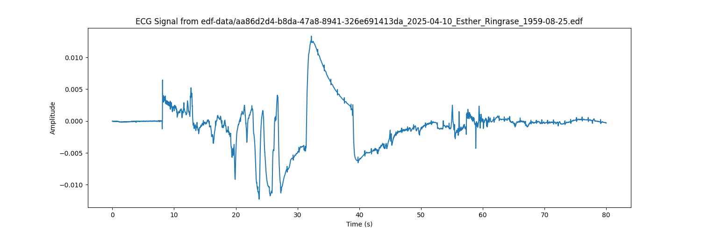

# ECG Analysis Suite


A comprehensive suite of applications for ECG signal processing, visualization, and analysis with a special focus on atrial fibrillation detection.

## Features

- **Advanced ECG Signal Processing**: Implements various filtering techniques and signal enhancement algorithms
- **Atrial Fibrillation Detection**: Specialized algorithms for detecting AF patterns in ECG recordings
- **Interactive Visualizations**: Rich, interactive dashboards for exploring ECG data
- **Multi-classifier Approach**: Combines multiple classification methods for improved accuracy
- **Holter Analysis**: Support for long-term ECG recordings analysis
- **Medical Reporting**: Generation of comprehensive medical reports with key cardiac metrics

## Applications

1. **AFDx: Advanced ECG & AF Detection** - A specialized tool for detecting and analyzing atrial fibrillation in ECG signals. Based on advanced algorithms from research on HRV analysis and AF pattern recognition.

2. **ECG Dashboard** - A visualization-focused dashboard for ECG data with multiple views, heart rate trends, and rhythm analysis.

3. **ECG DeepDive: Signal to Insight** - Advanced ECG analysis with over 100 cardiac biomarkers, detailed feature extraction, and multi-classifier approach.

4. **Holter ECG Review** - A comprehensive web application for analyzing ECG data from EDF files with a focus on arrhythmia detection and medical reporting.

## Screenshots



## Getting Started

### Prerequisites

- Python 3.7+
- pip package manager

### Installation

1. Clone this repository
   ```bash
   git clone https://github.com/chiragkansara/ecg-analysis.git
   cd ecg-analysis
   ```

2. Install the required dependencies:
   ```bash
   pip install -r requirements.txt
   ```

3. Launch the application suite:
   ```bash
   streamlit run ecg_launcher.py
   ```

## Usage

The ECG Analysis Suite offers multiple applications that can be accessed through the launcher:

```bash
streamlit run ecg_launcher.py
```

For detailed usage instructions for each application, please refer to the documentation in the `docs` directory.

## Documentation

Comprehensive documentation is available in the `docs` directory:

- [Installation & Deployment Guide](docs/installation_deployment.md)
- [AF Detection App Overview](docs/af_detection_app_overview.md)
- [AF Detection Technical Details](docs/af_detection_technical.md)
- [AF Detection User Guide](docs/af_detection_user_guide.md)
- [ECG Dashboard Documentation](docs/ecg_dashboard.md)
- [Enhanced ECG App Documentation](docs/enhanced_ecg_app.md)

## System Requirements

- Python 3.7+
- Streamlit
- NumPy/Pandas
- Matplotlib/Plotly
- NeuroKit2
- BiospPy
- Other dependencies listed in requirements.txt

## Contributing

Contributions are welcome! Please feel free to submit a Pull Request.

## Author

**Chirag Kansara/Ahmedabadi**  
Founder and CTO, IndaPoint Technologies Private Limited  
[LinkedIn](https://www.linkedin.com/in/indapoint/)  
[Website](https://www.indapoint.com/)

## License

This project is licensed under the MIT License - see the [LICENSE](LICENSE) file for details.

© 2025 Chirag Kansara/Ahmedabadi, IndaPoint Technologies Private Limited.